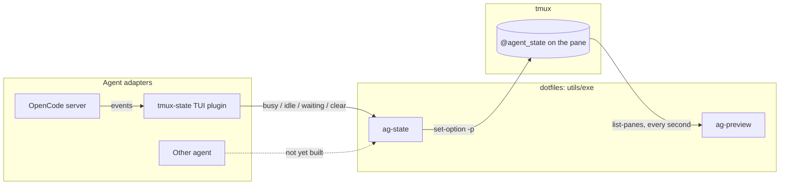

# Agent state

This guide covers how coding agents report whether they are busy, idle, or waiting for input, and how the tmux agent picker shows it.

## Motivation

I run several coding agents at once, each in its own tmux pane. The agent picker (`ag-preview`) lists those panes with a marker next to each agent, so I can see at a glance which agents are working and which need me:

| Marker | State         | Meaning                                                         |
|--------|---------------|-----------------------------------------------------------------|
| `●`    | `busy`        | The agent is working.                                           |
| `○`    | `idle`        | The agent finished and is waiting for a new prompt.             |
| `!`    | `waiting`     | The agent is blocked on me, for example on a permission prompt. |
| blank  | unset         | The agent doesn't report state, or hasn't yet.                  |
| `?`    | anything else | A writer sent a value the picker doesn't know.                  |

The agents report their own state from their hooks or plugins. The picker never guesses it from screen output.

## Architecture

The state lives in a tmux user option, `@agent_state`, set on the agent's pane. tmux removes the option when the pane closes, and the option follows the pane if it moves to another window.



The setup has three parts, each with one job.

- Agent adapters decide what state the agent is in. They know about one agent's events and nothing about tmux. They live with each agent's own configuration, outside this repository.
- `utils/exe/ag-state` is the only code that writes the state. It takes `busy`, `idle`, `waiting`, or `clear`, and writes to the pane in `$TMUX_PANE`. It does nothing outside tmux and rejects unknown values with exit code 2.
- `utils/exe/ag-preview` reads the state. It adds `#{@agent_state}` to its `tmux list-panes` format, so reading costs no extra tmux calls. It maps each value to a marker and reloads the list every second through `ag-preview --list`.

Values describe meaning, never presentation. Adapters write `busy`, not `●`, so the markers can change without touching any adapter.

`ag-preview` still decides which panes are agents from the pane title or window name, using the agent tags listed in the script, and hides panes where a plain shell is in the foreground. That second check also hides panes whose agent exited without clearing its state.

## OpenCode adapter

The adapter is an OpenCode TUI plugin named `tmux-state`.

It is a TUI plugin, not a server plugin, for a specific reason. In OpenCode v2, the process in the pane is only a client. Server plugins run in one background server that all OpenCode panes share, and that server's `$TMUX_PANE` belongs to whichever pane started it. A TUI plugin runs in the pane's own process, so its `$TMUX_PANE` is correct. A plugin directory that contains only `tui.ts` loads in the TUI and not in the server.

The plugin works like this:

1. It subscribes to six events: `session.execution.started`, `.succeeded`, `.failed`, `.interrupted`, `permission.asked`, and `permission.replied`.
2. It ignores events whose session has a different root than the session on screen. The server sends every TUI the events for every session in the same directory, including sessions shown in other panes. Comparing roots instead of IDs lets subagent events through.
3. For a matching event, it waits one microtask so OpenCode can apply the event to its own in-memory data. Then it computes the state from that data instead of from the event:
   - If the root session isn't running, the state is `idle`.
   - If any session in the family has a pending permission, the state is `waiting`.
   - Otherwise, the state is `busy`.
4. It calls `ag-state` synchronously, with a one-second timeout, and ignores any failure.
5. When the plugin unloads, it calls `ag-state clear`.

The data reads (`session.root`, `session.status`, `session.family`, `session.permission.list`) come from the TUI's memory and make no network calls. Because every write is computed from current data, a missed or out-of-order event can't leave a stale state. The next matching event corrects it. The "not running" check comes first so that the end of a turn always clears `waiting`, even if a permission never gets a reply event.

## Adding another agent

When adding an adapter for another agent, keep these points in mind.

- Write state only through `ag-state`. Don't call `tmux set-option` from an adapter. To add a state, change `ag-state` and the marker mapping in `ag-preview` together, then update the table at the top of this guide.
- Make sure the hook runs inside the pane's process tree, so `$TMUX_PANE` points at the right pane. Check where the agent runs its hooks before relying on the variable. OpenCode's server plugins are an example of hooks that run somewhere else.
- Report only the session shown in this pane. Check whether the agent delivers events for other sessions, as OpenCode does.
- Count subagents as part of their parent. A subagent's permission prompt should show `waiting` on the parent's pane.
- Prefer computing the state from the agent's current data over mapping the last event to a state. If the agent offers no such data, a direct mapping works, but check what happens on interrupts and when several permission prompts are pending.
- Check how the agent reports an interrupt. If it fires no "turn ended" hook on interrupt, the pane can stay `busy`.
- Never let the adapter break the agent. Ignore failures and keep timeouts short. A missing `ag-state` shows up only as blank markers.
- Clear the state on exit if the agent has an exit hook. If it doesn't, the shell check in `ag-preview` hides the pane anyway.
- The pane still needs a title or window name that matches the picker's agent tags.
- Log the agent's events to a file before writing the adapter. Watch a normal prompt, an approved permission, a rejected permission, an interrupt, and a subagent asking for permission.

## Checking the setup

```sh
ag-state waiting                                      # write a state to the current pane
tmux show-options -p -t "$TMUX_PANE" @agent_state     # read it back
ag-preview --list                                     # see the rows and markers the picker shows
ag-state clear                                        # remove it
```

If markers stay blank for an agent that should report state, check that `ag-state` is on the agent's `PATH` and that its adapter loaded.
